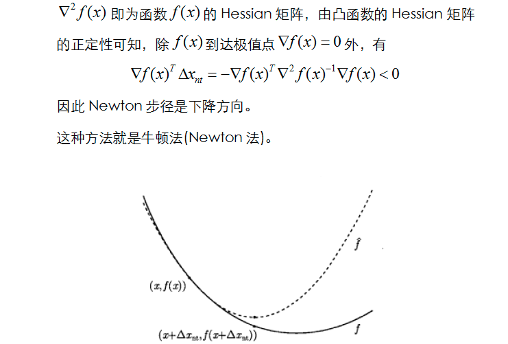

## Content

- [Urban Transportation](#urban-transportation)
  * [User Euqilibrium](#user-euqilibrium)
    + [Mathematical Model](#mathematical-model)
    + [All or Nothing](#all-or-nothing)
    + [Incremental Assignment](#incremental-assignment)
    + [Beckmann's Transformation](#beckmann-s-transformation)
  * [System Optimum](#system-optimum)
  * [Network Loading Models](#network-loading-models)
    + 
    + [Logit-Based Loading Models](#logit-based-loading-models)
  * [Max-Flow Problem](#max-flow-problem)
  * [Minimum Cost Flow](#minimum-cost-flow)
  * [Queueing Theory](#queueing-theory)
- [Optimization Problem](#optimization-problem)
  * [Convex Optimization](#convex-optimization)
  * [Unconstrained Optimization](#unconstrained-optimization)
  * [KKT Condition](#kkt-condition)
  * [Newton's Method](#newton-s-method)
  * [Quasi-Newton's Method](#quasi-newton-s-method)
  * [No-linear Equation](#no-linear-equation)
- [Integer Programming](#integer-programming)
  * [Branch and Bound](#branch-and-bound)
  * [Branch and Cut](#branch-and-cut)
  * [Branch and Price](#branch-and-price)
  * [Lagrangian Decomposition](#lagrangian-decomposition)
  * [Column Generation](#column-generation)
  * [DW Decomposition](#dw-decomposition)
  * [Bender Decomposition](#bender-decomposition)
  * [Iterated Local Search](#iterated-local-search)

## Urban Transportation 

This part contains some problems introduced in *Sheffi Y. Urban transportation networks[M]. Prentice-Hall, Englewood Cliffs, NJ, 1985* and operation research.

### BPR Function

BRP fucntion is the 

 functions of the  is conducting research on road traffic impedance

### User Euqilibrium

#### Mathematical Model

Wordrop equilibrium

#### Heuristic method

1. All or Nothing

2. Incremental Assignment

### Beckmann's Transformation

Beckmann's transformation can convert the euqilibrium into a convex problem

### Stochastic User Euqilibrium

### System Optimum

System optimum is expected in all cities because it can 

The system condition should meet the following 

### Network Loading Models

When there are serval choice for passengers, different ways will afford different demands. For example, if from point A to point B people can choose subway or taxi, different people will choose different ways. As a result, different approches will afford different loading.

#### Choice Function

#### Logit-Based Loading Models 

This logit modl is similar to the softmax.

I have done a project compute the  

## Network Problem

### Max-Flow Problem

### Minimum Cost Flow

## Simulation

### Random Number

### Queueing Theory

## Optimization Problem

This part contains some issues introduced in *Nocedal J, Wright S. Numerical optimization[M]. Springer Science & Business Media, 2006* and *Boyd S, Boyd S P, Vandenberghe L. Convex optimization[M]. Cambridge university press, 2004*.

### Convex Optimization

### Unconstrained Optimization

局部最优：

全局最优：

### KKT Condition

非约束优化中，最终

### Dual Problem

### Newton's Method

中文参考资料：https://zhuanlan.zhihu.com/p/33544363

### Quasi-Newton's Method

### No-linear Equation

## Integer Programming

### Branch and Bound

编辑中

### Branch and Cut

编辑中

### Branch and Price

编辑中

### Lagrangian Decomposition

编辑中

### Column Generation

编辑中

### DW Decomposition

编辑中

### Bender Decomposition

编辑中

### Iterated Local Search

Local search is a heuristic approch for integer programming. This approache will limit the searching region and search the local region of the initial solution iteratively. However, the solution time depends on the initial solution and it may fall into local optimum.

## Reinforcement Learning

In schedule 

## 高等数学与线性代数

### 泰勒与拉格朗日展开

### 多元二阶泰勒展开

证明过程中文版：多元函数的泰勒展开式 -  https://zhuanlan.zhihu.com/p/33316479

### 拉普拉斯展开

### 统计学

