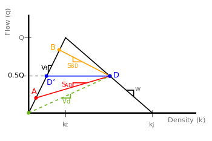
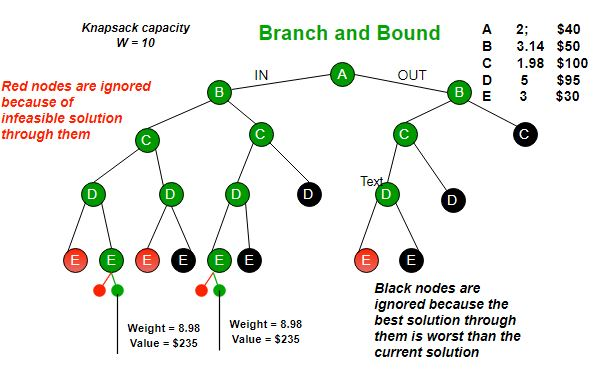
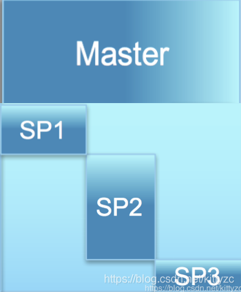
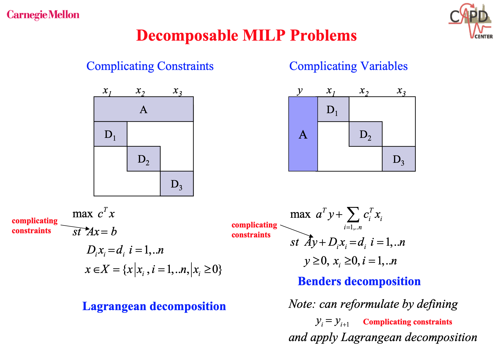

# Note for Transportation and Optimization

This readme includes my notes for problems in urban transportation, network problems, numerical optimization, and integer programming. Besides, my projects and algorithms implementation for some topics are also introduced. This document is still updating.

My research field now concentrates on *Network Modelling and Optimization* and *Shared Mobility*. If you have any question, please contact: tjyangshan@gmail.com 

## Projects and Algorithms

- [User-Equilibrium-Project&Line-Search](User-Equilibrium-Project&Line-Search): In this folder, the course project on the topic of user equilibrium in course lectured by Dr. Wang Xiaolei will be introduced. It includes Frank-Wolf Algorithms, Beckmann Transformation, and Line Search.
- [A-Convex-Programming-Approach-for-Ridesharing-User-Equilibrium-Under-Fixed-Driver/Rider-Demand](A-Convex-Programming-Approach-for-Ridesharing-User-Equilibrium-Under-Fixed-Driver&Rider-Demand): Note for this paper proposed by Dr. Wang
- [Integer-Programming-Algorithms](Integer-Programming-Algorithms): Some important algorithms for discrete problems.
- [Network-Problem-Algorithms](Network-Problem-Algorithms): Algorithms for problems in min-cost flow and max-flow.
- [Network-Loading-Project](Network-Loading-Project): This folder contains a project in which I solved the network loading problem using logit regression model.

## Notes

- [Urban Transportation](#urban-transportation)
  * [BPR Function](#bpr-function)
  * [User Euqilibrium](#user-euqilibrium)
    + [Mathematical Model](#mathematical-model)
    + [Heuristic method](#heuristic-method)
  * [Beckmann's Transformation](#beckmann-s-transformation)
  * [System Optimum](#system-optimum)
    + [Model Introduction](#model-introduction)
    + [Price of Anarchy](#price-of-anarchy)
  * [Network Loading Models](#network-loading-models)
    + [Why investigate?](#why-investigate-)
    + [Choice Function](#choice-function)
    + [Logit-Based Loading Models](#logit-based-loading-models)
  * [Traffic bottleneck](#traffic-bottleneck)
    + [Stationary bottleneck](#stationary-bottleneck)
    + [Moving bottleneck](#moving-bottleneck)
- [Network Problem](#network-problem)
  * [Shortest Path Problem](#shortest-path-problem)
  * [Graph Algorithm](#graph-algorithm)
  * [Max-Flow Problem](#max-flow-problem)
    + [Ford-Fulkerson](#ford-fulkerson)
    + [Capacity Scaling Algorithm](#capacity-scaling-algorithm)
    + [Preflow Push Algorithm](#preflow-push-algorithm)
    + [Application](#application)
  * [Minimum Cost Flow](#minimum-cost-flow)
    + [Cycle canceling algorithm](#cycle-canceling-algorithm)
    + [Successive shortest path algorithm](#successive-shortest-path-algorithm)
    + [Application-Assignment](#application-assignment)
    + [Application-Schedule](#application-schedule)
- [Optimization Problem](#optimization-problem)
  * [Unconstrained Optimization](#unconstrained-optimization)
  * [Line Search Methods](#line-search-methods)
    + [Introduction to Line Search](#introduction-to-line-search)
    + [Steppest Direction](#steppest-direction)
    + [Newton Direction](#newton-direction)
  * [Scaling](#scaling)
  * [Trust Region](#trust-region)
  * [Quasi-Newton's Method](#quasi-newton-s-method)
  * [KKT Condition](#kkt-condition)
  * [Others](#others)
- [Integer Programming](#integer-programming)
  * [Algorithms](#algorithms)
  * [Branch and Bound](#branch-and-bound)
  * [Branch and Cut](#branch-and-cut)
  * [Column Generation](#column-generation)
  * [Bender Decomposition](#bender-decomposition)
  * [DW Decomposition](#dw-decomposition)
  * [Lagrangean Decomposition](#lagrangean-decomposition)
- [Reinforcement&Online Learning](#reinforcement-online-learning)

# Urban Transportation 

This part contains some problems introduced in *Sheffi Y. Urban transportation networks[M]. Prentice-Hall, Englewood Cliffs, NJ, 1985* , wiki, and *operation research*

## BPR Function

Suppose we are considering a highway network. For each link there is a function stating the relationship between resistance and volume of traffic. The Bureau of Public Roads (BPR) developed a link (arc) congestion (or volume-delay, or link performance) function.

$t_a$ = free-flow travel time on link a per unit of time

$Q_a$ = flow (or volume) of traffic on link a per unit of time (somewhat more accurately: flow attempting to use link a)

$c_a$ = capacity of link a per unit of time

$S_a(Q_a)$ is the average travel time for a vehicle on link a

## User Euqilibrium

**In brief, A network is in user equilibrium (UE) when every driver chooses the routes in its lowest cost between origin and destination regardless whether total system cost is minimized.**

The user equilibrium assumes that all users choose their own route towards their destination based on the travel time that will be consumed in different route options. The users will choose the route which requires the least travel time. The user euqilibrium model is often used in simulating the impact on traffic assignment by highway bottlenecks. When the congestion occurs on highway, it will extend the delay time in travelling through the highway and create a longer travel time. Under the user optimum assumption, the users would choose to wait until the travel time using a certain freeway is equal to the travel time using city streets, and hence equilibrium is reached. This equilibrium is called User Equilibrium, Wardrop Equilibrium or Nash Equilibrium.

The core principle of User Equilibrium is that all used routes between a given OD pair have the same travel time. An alternative route option is enabled to use when the actual travel time in the system has reached the free-flow travel time on that route.  [From Wiki]

**How to solve user euqilibrium by convex optimization is introduced in [User-Equilibrium-Project&Line-Search](User-Equilibrium-Project&Line-Search)**

### Mathematical Model

Passengers can not choose another route to lower their cost.

### Heuristic method

1. All or Nothing

2. Incremental Assignment

## Beckmann's Transformation

Beckmann's transformation can convert the user euqilibrium problem to a convex problem

## System Optimum

**In short, a network is in system optimum (SO) when the total system cost is the minimum among all possible assignments.**

System Optimum is based on the assumption that routes of all vehicles would be controlled by the system, and that rerouting would be based on maximum utilization of resources and minimum total system cost. (Cost can be interpreted as travel time.) Hence, in a System Optimum routing algorithm, all routes between a given OD pair have the same marginal cost. In traditional transportation economics, System Optimum is determined by equilibrium of demand function and marginal cost function. In this approach, marginal cost is roughly depicted as increasing function in traffic congestion. In traffic flow approach, the marginal cost of the trip can be expressed as sum of the cost(delay time, w) experienced by the driver and the externality(e) that a driver imposes on the rest of the users.  [From wiki]

### Model Introduction

The system condition should meet the following：

The KKT conditions of the SO problem:

It is a simple problem to solve compared with the user euqilibrium.

### Price of Anarchy

The reason we have congestion is that people are selfish. The cost of that selfishness (when people behave according to their own interest rather than society's) is the price of anarchy. The ratio of system-wide travel time under User Equilibrium and System Optimal conditions.

## Network Loading Models

*Review is required*

### Why investigate?

When there are serval choices for passengers, different ways will afford different demands. For example, if from point A to point B people can choose subway or taxi, different people will choose different ways. As a result, different approaches will afford different loading.

### Choice Function

Let $U = (U_1, ... , U_K)$ denote the vector of utilities associated with a given set of alternatives, $K$. This set includes K alternative snumbered 1, 2, ... , *K.* The utility of each alternative to a specific decision maker can be expressed as a function of the observed attributes of the alternatives and the observed characteristics of this decision maker. Let **a** denote the vector of variables which include these characteristics and attributes. Thus $U_k = U_k(a)$. To incorporate the effects of unobserved attributes and characteristics, the utility of each alternative is expressed as a random variable consisting of a systematic (deterministic) component, $V_k(a)$,and an additive random "error term", **k(a),**that is, 

The random component of the utility satisfies $E[\xi_k(a)]= 0$, meaning that $E[U_k(a)] = V_k(a)$.In this context, Uk(a) is sometimes referred to as the "per- ceived utility" and $V_k(a)$ as the "measured utility."

The choice probability is then the probability that $U_k(a)$ is higher than the utility of any other alternative and 

### Logit-Based Loading Models 

This logit model is similar to the softmax model.

**Project based on this model: [network-loading-model](network-loading-model)**

## Traffic bottleneck

Traffic bottlenecks are disruptions of traffic on a roadway caused either due to road design, traffic lights, or accidents. There are two general types of bottlenecks, stationary and moving bottlenecks. Stationary bottlenecks are those that arise due to a disturbance that occurs due to a stationary situation like narrowing of a roadway, an accident. Moving bottlenecks on the other hand are those vehicles or vehicle behavior that causes the disruption in the vehicles which are upstream of the vehicle. Generally, moving bottlenecks are caused by heavy trucks as they are slow moving vehicles with less acceleration and also may make lane changes.

Bottlenecks are important considerations because they impact the flow in traffic, the average speeds of the vehicles. The main consequence of a bottleneck is an immediate reduction in capacity of the roadway. The Federal Highway Authority has stated that 40% of all congestion is from bottlenecks figure 16 shows the pie-chart for various causes of congestion. Figure 17 shows the common causes of congestion or bottlenecks. [From Wiki]

### Stationary bottleneck

The general cause of stationary bottlenecks are lane drops which occurs when the a multilane roadway loses one or more its lane. This causes the vehicular traffic in the ending lanes to merge onto the other lanes.

Consider a stretch of highway with two lanes in one direction. Suppose that the fundamental diagram is modeled as shown here. The highway has a peak capacity of Q vehicles per hour, corresponding to a density of kc vehicles per mile. The highway normally becomes jammed at kj vehicles per mile.

Before capacity is reached, traffic may flow at A vehicles per hour, or a higher B vehicles per hour. In either case, the speed of vehicles is vf, or "free flow," because the roadway is under capacity.

Now, suppose that at a certain location x0, the highway narrows to one lane. The maximum capacity is now limited to D', or half of Q, since only one lane of the two is available. D shares the same flowrate as state D', but its vehicular density is higher.

Using a time-space diagram, we may model the bottleneck event. Suppose that at time 0, traffic begins to flow at rate B and speed vf. After time t1, vehicles arrive at the lower flowrate A. [From Wiki]

### Moving bottleneck

As explained above, moving bottlenecks are caused due to slow moving vehicles that cause disruption in traffic. Moving bottlenecks can be active or inactive bottlenecks. If the reduced capacity(qu) caused due to a moving bottleneck is greater than the actual capacity(μ) downstream of the vehicle, then this bottleneck is said to be an active bottleneck. Figure 20 shows the case of a truck moving with velocity 'v' approaching a downstream location with capacity 'μ'. If the reduced capacity of the truck (qu) is less than the downstream capacity, then the truck becomes an inactive bottleneck.[From Wiki]

# Network Problem

## Shortest Path Problem

Refer to my another repository: https://github.com/seanys/Data-Structure-Algoirthm-Tongji-SEM

## Graph Algorithm

Refer to my another repository: https://github.com/seanys/Data-Structure-Algoirthm-Tongji-SEM

## Max-Flow Problem

### Ford-Fulkerson

Only can handle network that capacity is rational. Just find augument path iteratively.

### Capacity Scaling Algorithm

Similar to ford-fulkerson.

### Preflow Push Algorithm

### Application

The same as shortest path problem, many issues can be converted to the max-flow problem.

## Minimum Cost Flow

### Cycle canceling algorithm 

### Successive shortest path algorithm 

Need review.

### Application-Assignment

### Application-Schedule

# Optimization Problem

This part contains some issues introduced in *Nocedal J, Wright S. Numerical optimization[M]. Springer Science & Business Media, 2006* and *Boyd S, Boyd S P, Vandenberghe L. Convex optimization[M]. Cambridge university press, 2004*.

## Unconstrained Optimization

**First Oder Necessary Conditions**: If $x^*$ is a local minimizer and $f$ is continuously differentiable in an open neighborhood of $x^*$, then $\nabla  f(x^∗)=0$ .

**Second Oder Necessary Conditions**: If $x^*$ is a local minimizer of $f$ and $\nabla^2f$ exists and is continuous in an open neighborhood of $x^∗$, then $\nabla f(x^*) = 0$ and $\nabla f(x^*)$ is positive semidefinite.

**Second Order Sufficient Conditions**: Suppose that $\nabla^2 f$ is continuous in an open neighborhood of $x^*$ and that $\nabla f(x^*)=0$ and $\nabla^2 f(x^*)$ is positive definite. Then $x^*$ is a strict local minimizer of $f$.

**Second-Order Sufficient Conditions**: Suppose that $\nabla^2 f$ is continuous in an open neighborhood of  $x^*$ and that $\nabla f(x^*)  = 0$ and $\nabla^2 f$ is positive definite. Then $x^*$ is a strict local minimizer of $f$.

These four theorems introduce how to obtain the local optimal of a function $f$. Moreover, if $f$ if convex, any local minimizer $x^*$ is a global minimizer. If $f$ is differentiable, then any stationary point $x^*$ is a global minimizer.

## Line Search Methods 

### Introduction to Line Search

Algorithms Application: [User-Equilibrium-Project&Line-Search](User-Equilibrium-Project&Line-Search)

In the *line search* strategy, the algorithm chooses a direction $p_k$ and searches along this direction from the current iterate $x_k$ for a new iterate with a lower function value. The distance to move along $p_k$ can be found by approximately solving the following one- dimensional minimization problem to find a step length α: 

We would derive the maximum benefit from the direction $p_k$ , but an exact minimization may be expensive and is usually unnecessary. Instead, the line search algorithm generates a limited number of trial step lengths until it finds one that loosely approximates the minimum of  this objective. At the new point, a new search direction and step length are computed, and the process is repeated. 

### Steppest Direction

### Newton Direction

The Newton direction can be used in a line search method when $\nabla^2 f_k$ is positive definite, for in this case we have:

Unlike the steepest descent direction, there is a “natural” step length of 1 associated with the Newton direction. Most line search implementations of Newton’s method use the unit step $\alpha = 1$  where possible and adjust α only when it does not produce a satisfactory reduction in the value of *f* . 

中文参考资料：https://zhuanlan.zhihu.com/p/33544363

## Scaling

## Trust Region

Line search starts by fixing the direction $p_k$ and then identifying an appropriate distance, namely the step length $α_k$ . In trust region, we first choose a maximum distance—the trust-region radius $\Delta k$ —and then seek a direction and step that attain the best improvement possible subject to this distance constraint. If this step proves to be unsatisfactory, we reduce the distance measure $\Delta k$ and try again. 

## Quasi-Newton's Method

*Quasi-Newton* search directions provide an attractive alternative to Newton’s method in that they do not require computation of the Hessian and yet still attain a superlinear rate of convergence.  In place of the true Hessian $\nabla^2 f_k$, they use an approximation $B_k$, which is updated after each step to take account of the additional knowledge gained during the step. 

This is the BFGS update. One can show that BFGS update generates positive definite approximations whenever the initial approximation $B_0$ is positive definite and $s_k^T y_k$ > 0.

The quasi-Newton search direction is:

## KKT Condition

## Others

- No-linear eqution
- Least-Square Problem

# Integer Programming

In carsharing system, there many problems whose solutions are discrete such as scheduling and dispatching problem. Most of them are NP-hard. In general, heruistic algorithms for integer programming are efficient approaches to handle them. 

## Algorithms

- Branch and Bound
- Branch and Cut
- Branch and Price
- Lagrangian Decompsoition
- Column Generation
- DW Decomposition
- Bender Decomposition

## Branch and Bound

Branch and bound (BB, B&B, or BnB) is an algorithm design paradigm for discrete and combinatorial optimization problems, as well as mathematical optimization. A branch-and-bound algorithm consists of a systematic enumeration of candidate solutions by means of state space search: the set of candidate solutions is thought of as forming a rooted tree with the full set at the root. The algorithm explores branches of this tree, which represent subsets of the solution set. Before enumerating the candidate solutions of a branch, the branch is checked against upper and lower estimated bounds on the optimal solution, and is discarded if it cannot produce a better solution than the best one found so far by the algorithm.

## Branch and Cut

Branch and cut is a method of combinatorial optimization for solving integer linear programs (ILPs), that is, linear programming (LP) problems where some or all the unknowns are restricted to integer values. Branch and cut involves running a branch and bound algorithm and using cutting planes to tighten the linear programming relaxations. Note that if cuts are only used to tighten the initial LP relaxation, the algorithm is called cut and branch.

## Column Generation

Reference: https://zhuanlan.zhihu.com/p/118516953

Code: [column generation.py](Integer-Programming-Algorithms/column_generation.py)

## Bender Decomposition

Code: [bender decomposition.py](Integer-Programming-Algorithms/bender_decomposition.py)

**Bender Decomposition is a algorithm for MIP problem.**

1. Problem can be formulated to have only one continous var with a lot more constraints
2. Because only a small number of constraints are useful, we can drop most of them.

**Procedure**

1. Start with a relaxed BMP with no constraints or just a few, sovle to optimal
2. We also have an upper bound Zub
3. Solve the dual problem to get u, it may be 
   1. Infeasible(Dual Unbounded), generate v to find violated feasibility cut
   2. has a solution, add u related optimality cut, we has a lower bound

## DW Decomposition

Code: [dw decomposition.py](Integer-Programming-Algorithms/dw_decomposition.py)

It is a approache similar to column generation.

## Lagrangean Decomposition

http://egon.cheme.cmu.edu/ewo/docs/EWOLagrangeanGrossmann.pdf

# Reinforcement&Online Learning

RL has been applied to many NP-hard scenarios such as travel salesman problem and convex hull problem.  Online learning is similar to reinforcement learning and has more implementation scenarios. These two tools will be important to problems in carsharing and ridesharing in the future.

# 高等数学与线性代数

## 多元二阶泰勒展开

证明过程中文版：多元函数的泰勒展开式 -  https://zhuanlan.zhihu.com/p/33316479

## 拉普拉斯展开

## 统计学

